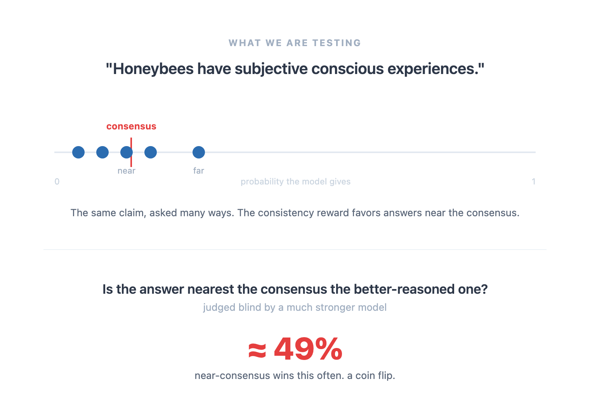
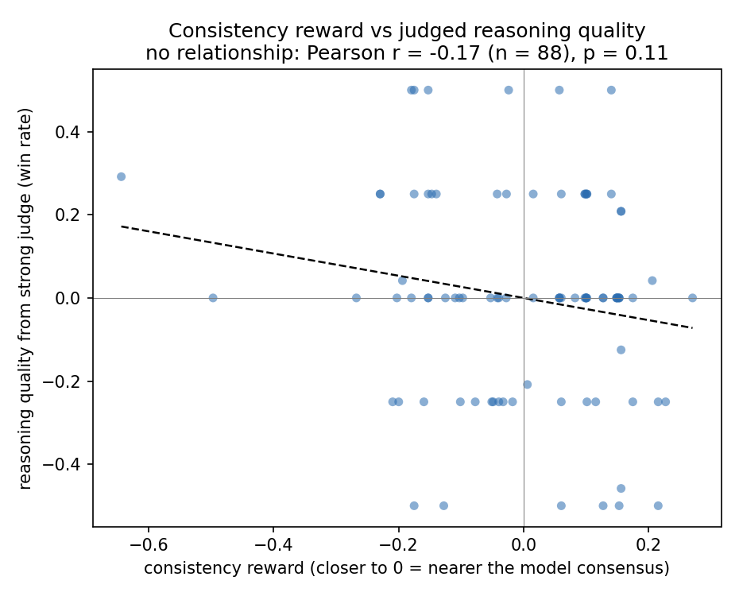
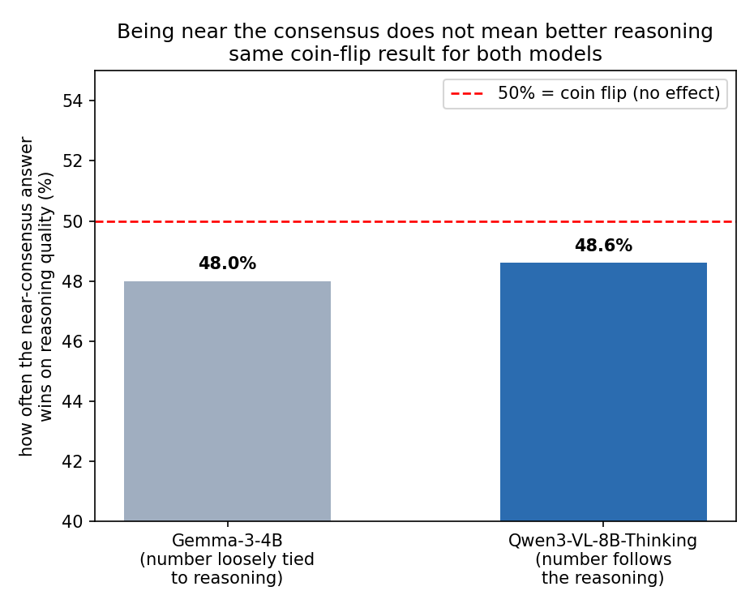

# Consistency Training: Preliminary Test

This is a small experiment that tests one idea from a larger consistency-training proposal.



## The idea being tested

A "consistency reward" gives a model a higher score when it gives the same answer to
questions that mean the same thing. The hope is that training a model to be consistent works
like training it against a stronger judge of quality. In other words, the answer the model
settles on (its consensus) is supposed to also be the better-reasoned answer.

This repo checks whether that hope holds. The core question is simple: when a model gives
different probabilities to the same claim, is the answer closer to its consensus actually the
better-reasoned one?

## What we did

1. Generate questions. Two kinds:
   - Type 1: a claim plus four neutral rephrasings that mean the same thing.
   - Type 2: a claim A plus a richer claim "A and B", where "A and B" must logically imply A,
     so a careful reasoner should never rate "A and B" as more likely than A.
2. Sample several chain-of-thought answers per question from a small open model.
3. Score each answer with the consistency reward from the design document.
4. Have a much stronger model (Claude Opus) judge reasoning quality in blind pairwise
   matchups, with no mention of the number or the reward.
5. Measure whether the consistency reward agrees with the strong judge.

We keep only questions where the small model is naturally inconsistent, so there is real
signal to study. We compare answers near the consensus against answers far from it.

## What we found

The consistency reward does not behave like a stronger judge. Answers near the consensus win
their reasoning-quality matchups about as often as they lose. This held for two very different
models, including a reasoning model whose final number is tied closely to its thinking.





The conjunction test (Type 2) gave a related result. With valid questions and a real reasoning
model, the model almost never broke the rule that "A and B" cannot beat A. A careful reasoner
sees the trap and avoids it, so there is nothing for the reward to fix.

## Why this happens

We checked that the judge itself works. On clear cases it picks the better answer almost every
time (100 percent when one answer is off-topic or self-contradictory), it is stable when we flip
the display order (85 percent), and its written reasons are specific and correct.

The real reason is about the consensus, not the judge. The consensus is just the average of the
model's own answers, and that average carries the model's shared mistakes. When the model is
collectively overconfident, the consensus is wrong, and the judge prefers the calibrated answer
that sits far from the consensus. So rewarding consistency can reward agreement with the model's
average error instead of rewarding correct reasoning. The consensus is not the same thing as the
truth.

## What this suggests next

The reward can only track quality when stronger reasoning leads to a known answer and the model
reaches that answer often enough that its consensus lands near it. The clean next test uses
questions with a real correct answer, such as logic, probability, or estimation problems. Then
we can measure directly whether the consensus tracks the truth.

## How to run

```bash
python3.12 -m venv .venv
.venv/bin/pip install -r requirements.txt
# add your key for rollouts to a .env file: OPENROUTER=sk-or-...
# the judge uses the local `claude` CLI and your subscription, not an API key

# full pilot, end to end
PYTHONPATH=src .venv/bin/python -m consistency.run --pilot

# or one stage at a time
PYTHONPATH=src .venv/bin/python -m consistency.run --pilot --stage select
```

Stages run in order: generate, rollout, select, reward, judge, quality, correlate.

## Layout

- `src/consistency/` the pipeline, one file per stage
- `control-room/` the design documents and the question-and-answer decision log
- `assets/` the figures used above
- `data/` and `results/` generated outputs, not tracked
